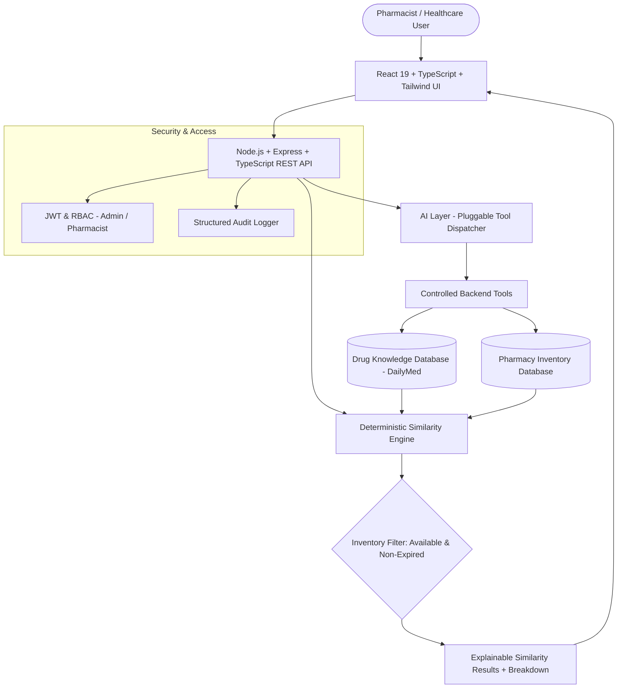

# PharmaMatch AI (Pharmatech) 💊

> **Clinical Pharmacy Intelligence Platform for Deterministic Drug Similarity, Inventory Cross-Referencing, and AI-Assisted Pharmacist Verification.**

PharmaMatch AI is a healthcare intelligence system designed to automate the workflow of identifying potentially similar medications when a requested product is unavailable in pharmacy inventory.

The system does **NOT** blindly recommend medications or act as an autonomous replacement-prescribing engine. Instead, it combines **authoritative drug monographs (DailyMed/FDA)**, **primary active ingredient extraction**, a **deterministic multi-factor similarity engine**, and **real-time pharmacy inventory cross-referencing**—requiring mandatory licensed pharmacist review before any substitution.

---

## 🏗️ System Architecture



---

## 🎯 The Core Business Workflow

```
PHARMACIST SEARCHES MEDICATION (e.g. "Calmag" or "كالماج")
                  │
                  ▼
         CHECK PHARMACY INVENTORY
                  │
         ┌────────┴────────┐
         │                 │
    IN STOCK          OUT OF STOCK (Calmag: 0 Qty)
         │                 │
    Display Stock          ▼
                      RETRIEVE TRUSTED MONOGRAPH (DailyMed/FDA)
                           │
                           ▼
                      EXTRACT PRIMARY ACTIVE INGREDIENT
                      (Primary: Calcium | Secondary: Magnesium, Vitamin D)
                           │
                           ▼
                      SEARCH DRUG DATABASE FOR CANDIDATES
                      (Calcitron, Osteocare, Caltrate, etc.)
                           │
                           ▼
                      DETERMINISTIC SIMILARITY ENGINE
                      [Primary: 60% | Strength: 20% | Form: 10% | Secondary: 10%]
                           │
                           ▼
                      CROSS-REFERENCE PHARMACY INVENTORY
                      (Filter Qty > 0, Exclude Expired & Discontinued)
                           │
                           ▼
                      RENDER EXPLAINABLE CANDIDATE CARDS
                      - "✓ Same primary active ingredient: Calcium"
                      - "✓ Same dosage form: Tablet"
                      - "△ Different secondary formulation"
                           │
                           ▼
                      MANDATORY PHARMACIST CLINICAL VERIFICATION
```

---

## ⚖️ Deterministic Similarity Algorithm

The similarity score is calculated by a rule-based engine independent of the LLM:

$$\text{Similarity Score} = (W_p \cdot S_p) + (W_s \cdot S_s) + (W_f \cdot S_f) + (W_{sec} \cdot S_{sec})$$

| Component | Default Weight | Formula & Logic |
| :--- | :--- | :--- |
| **Primary Active Ingredient ($S_p$)** | **60%** | Canonical normalized string match ($1.0$ if match, $0.0$ if mismatch). Anchor factor. |
| **Strength / Concentration ($S_s$)** | **20%** | Standardized base unit conversion (`500mg` = `0.5g`). Proximity ratio: $\min(v_1, v_2) / \max(v_1, v_2)$. |
| **Dosage Form & Route ($S_f$)** | **10%** | Form compatibility matrix (Identical: $1.0$, Same Family [Tablet/Capsule]: $0.8$, Incompatible [Oral/Topical]: $0.0$). |
| **Secondary Ingredients ($S_{sec}$)** | **10%** | Jaccard similarity index across supporting vitamins and minerals: $\frac{|A \cap B|}{|A \cup B|}$. |

### Similarity Classification Thresholds
- **$90 - 100\%$**: `VERY_HIGH` Match
- **$75 - 89\%$**: `HIGH` Similarity
- **$50 - 74\%$**: `MODERATE` Match
- **$25 - 49\%$**: `LOW` Similarity
- **$0 - 24\%$**: `NOT_SIMILAR`

---

## 🛡️ Medical Safety & Zero-Hallucination Principles

1. **Non-Autonomous Decision**: PharmaMatch AI never states "Calcitron is a safe substitute for Calmag." It explicitly uses wording such as *"Similar Product Sharing Primary Active Ingredient. Pharmacist review required."*
2. **Zero AI Hallucination**: The AI layer uses controlled backend tool calling only. It cannot invent medication names, stock counts, batch numbers, or medical provenance.
3. **Strict Inventory Safety**: Out-of-stock and expired items are strictly filtered out and never recommended as active alternatives.
4. **Complete Provenance**: Every drug product links directly to its source regulatory record (DailyMed, FDA, EMA).

---

## 🚀 Quickstart & Installation

### Prerequisites
- **Node.js**: v18 or higher (v24 supported)
- **npm**: v9 or higher

### Zero-Configuration Local Startup (Embedded In-Memory MongoDB)
PharmaMatch AI features an automated in-memory MongoDB fallback with pre-seeded clinical data. No external database installation is needed!

```bash
# 1. Clone or navigate to the repository
cd pharma

# 2. Install dependencies for all workspaces
npm install

# 3. Start both backend API (port 5000) and frontend Vite app (port 3000)
npm run dev
```

Open your browser at **[http://localhost:3000](http://localhost:3000)**.

### Default Login Accounts
| Role | Email | Password |
| :--- | :--- | :--- |
| **Pharmacist** | `pharmacist@pharmamatch.ai` | `Pharma@123456Password` |
| **Admin** | `admin@pharmamatch.ai` | `Admin@123456Password` |

*(Quick-switch role buttons are also available in the top navbar for instant evaluation).*

---

## 🐳 Docker Deployment

To launch the complete containerized stack (Frontend + Backend + MongoDB):

```bash
docker-compose up --build
```

- **Frontend Application**: `http://localhost:3000`
- **Backend REST API**: `http://localhost:5000`
- **API Health Check**: `http://localhost:5000/health`

---

## 📡 REST API Specifications

### Product & Search APIs
- `GET /api/products` - List all drug monographs with pagination and filters.
- `GET /api/products/search?q=:query` - Multilingual search (Exact, Arabic, Fuzzy).
- `GET /api/products/:id` - Monograph details with active ingredient roles and DailyMed source.
- `GET /api/products/:id/sources` - Regulatory provenance and reference citations.

### Similarity & Inventory APIs
- `GET /api/similarity/similar/:productId?onlyAvailable=true` - Calculates deterministic similarity and cross-references pharmacy inventory.
- `POST /api/similarity/compare` - Side-by-side structured formulation comparison between two medications.
- `GET /api/similarity/config` - Get active scoring weights and thresholds.
- `PATCH /api/similarity/config` - Update weights dynamically (Admin).
- `GET /api/inventory` - Shelf inventory with stock quantities, batches, and expiration dates.
- `GET /api/inventory/stats` - Stock valuation and out-of-stock metrics.

### AI & Feedback APIs
- `POST /api/ai/query` - Natural language NLU with live tool execution traces.
- `GET /api/ai/tools` - List registered tool schemas.
- `POST /api/audit/feedback` - Log pharmacist review (`USEFUL`, `NOT_USEFUL`, `NOT_CLINICALLY_SUITABLE`).
- `GET /api/audit/logs` - Paginated audit logs.

---

## 🧪 Automated Testing

To run the deterministic similarity engine unit and integration test suite:

```bash
npm run test --workspace=server
```

### Verified Test Cases
- ✅ **Test Case 1**: Target `Calmag` (Calcium) ↔ Candidate `Calcitron` (Calcium) $\rightarrow$ `Primary Match = TRUE`, `Score >= 75%`.
- ✅ **Test Case 2**: Target `Calmag` (Calcium) ↔ Candidate `Ibuprofen` (Ibuprofen) $\rightarrow$ `Primary Match = FALSE`, `Score < 40%`.
- ✅ **Test Case 3**: Target `Augmentin` ↔ Candidate `Curam` $\rightarrow$ Shared secondary `[Clavulanic acid]` recognized.
- ✅ **Test Case 4**: Candidate is similar but `OUT_OF_STOCK` $\rightarrow$ Excluded from available candidates.
- ✅ **Test Case 5**: Candidate is expired $\rightarrow$ Excluded from available candidates.

---

## 📄 License
MIT License. Developed for healthcare software intelligence and clinical pharmacist decision support.
